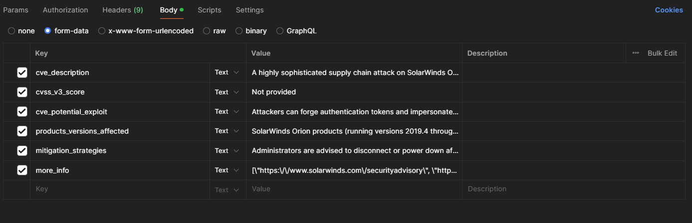

# Article Template Generator
A project utilising a finetuned Llama-3 model and automated data feeds through the GodWatch project to automate and reduce time spent on writing alerts in 
## Description
There are 2 main components of this project, the frontend and backend
- Frontend:
    - The website consists of 3 pages
        - Front page, with a brief guide on how to use the tool
        - Manual entry page, where users can fill a form to generate a response
        - Automatic generations result page, where users can attain a response without filling in the form
- Backend:
    - Docker container that serves the LLM as an API endpoint
        - The LLM runs inside a docker container. The model file (.gguf type) is loaded with [llama-cpp-python](https://github.com/abetlen/llama-cpp-python), a python-wrapper for [llama-cpp](https://github.com/ggerganov/llama.cpp)
        - The container then serves the model via an API endpoint using [Waitress](https://pypi.org/project/waitress/)


## Table of Contents

- [Installation](#installation)
- [Usage](#usage)
- [Features](#features)
- [Configuration and Maintenance](#configuration-and-maintenance)
- [License](#license)
- [Credits](#credits)
- [Contact](#contact)

## Installation
To use the prepackaged version of the generator, type the following command in a terminal pointing to the root folder
This command starts up both the backend API endpoint & the frontend web UI for interacting with the LLM

### Prerequisites
- Node.js
- Docker
- Article_Template_Generator folder
- Python 3.11.9^

### Additional prequisites to run the container with GPU support

- NVIDIA drivers
- WSL 2 (Windows)
- NVIDIA Container toolkit

#### Setting up additional prerequisites for GPU support
1. Download the latest drivers for your NVIDIA GPU [here](https://www.nvidia.com/download/index.aspx)
2. Download WSL 2 with a linux distribution, during development, Ubuntu was used, refer to [this guide](https://learn.microsoft.com/en-us/windows/wsl/install) for more info
3. Enable Docker Desktop WSL 2 backend on Windows, refer to [this guide]("https://docs.docker.com/desktop/wsl/#turn-on-docker-desktop-wsl-2"), don't forget to enable docker support for WSL 2 distros
4. Open `Ubuntu` or the linux distro you downloaded for WSL
5. Download NVIDIA container toolkit into WSL by following [this guide]("https://docs.nvidia.com/datacenter/cloud-native/container-toolkit/latest/install-guide.html") and running the commands inside thw WSL terminal. Follow the `Installation` and `Configuring Docker` portions
6. Test the installation of the toolkit by running 
```sh
sudo docker run --rm --runtime=nvidia --gpus all ubuntu nvidia-smi
```
Which should give a similar output to this:
```sh
+-----------------------------------------------------------------------------+
| NVIDIA-SMI 535.86.10    Driver Version: 535.86.10    CUDA Version: 12.2     |
|-------------------------------+----------------------+----------------------+
| GPU  Name        Persistence-M| Bus-Id        Disp.A | Volatile Uncorr. ECC |
| Fan  Temp  Perf  Pwr:Usage/Cap|         Memory-Usage | GPU-Util  Compute M. |
|                               |                      |               MIG M. |
|===============================+======================+======================|
|   0  Tesla T4            On   | 00000000:00:1E.0 Off |                    0 |
| N/A   34C    P8     9W /  70W |      0MiB / 15109MiB |      0%      Default |
|                               |                      |                  N/A |
+-------------------------------+----------------------+----------------------+

+-----------------------------------------------------------------------------+
| Processes:                                                                  |
|  GPU   GI   CI        PID   Type   Process name                  GPU Memory |
|        ID   ID                                                   Usage      |
|=============================================================================|
|  No running processes found                                                 |
```

### Steps

Provide a step-by-step guide on how to install the project. For example:
#### Default installation with GPU support (Recommended)
1. Download the folder
2. Unzip it and open a terminal in the root folder of the project
3. Type in the command:
```sh
user@Article_Template_Generator: docker compose up -d
```
4. Note that the IP address of the hosting machine + the model file itself must be present, in the `docker_cuda` folder

#### Manual installation (Windows)
1. Download the folder
2. Navigate to the `backend` folder
3. Download Visual Studio 2022, with the following options: 
    - Note: Download the appropriate windows SDK for your version
4. Run `python -m pip install -r requirements.txt`
#### Without GPU support
5. Run `python -m pip install llama-cpp-python`
#### With GPU support
5. Run 
```ps
$env:CMAKE_ARGS="-DLLAMA_CUBLAS=on"
$env:FORCE_CMAKE="1"
python -m pip install llama-cpp-python==0.2.79 --upgrade --force-reinstall --no-cache-dir
```
6. Finally to activate the API backend type
```sh
python api_llm.py
```
7. To activate the frontend website, navigate to the 'frontend_website' sub folder from the root folder
8. Type the following in a powershell window in that folder
```sh
user@Article_Template_Generator/frontend_website: npm run dev
```

## Usage
- There are 3 main ways of using the LLM:
  1. Through an API call
      - Send a post request to the IP address of the hosting machine at port 5000 (default)
      - Send it as a form, with the following 6 fields: 
  2. Through GodWatch's generate button
  3. Through the WebUI
      - You can key in the CVE-ID for automatic alert generation on the main page, which also has a built-in check for valid CVE-IDs
    
      - Alternatively, manual generation through the filling of a form can be done as well
    


## Features
### Model API endpoint
- Model is loaded in with llama-cpp
- The following modules were used to serve the API:
    - [Flask](https://flask.palletsprojects.com/en/2.3.x/)
    - [Waitress](https://pypi.org/project/waitress/)
- The re and bleach modules are used to sanitise input, but are not applied to links, because of potential breaking of links that it causes
```sh
def sanitize_input(data): 
    #2 step process, 
    # 1. sanitizing for regex (only allowed chars), 
    # 2. removing any html tags 
    bleached_data = bleach.clean(data)
    pattern = re.compile(r'[^a-zA-Z0-9\s@.,!?-`/]')
    cleaned_input = pattern.sub('', bleached_data)
    return cleaned_input
...
@app.route("/generate_template", methods = ["POST", "GET"])
def generate_article_template():
    ...
    if (possible_cve_description):
        possible_cve_description = sanitize_input(possible_cve_description)
    if (possible_cvss_v3_score):
        possible_cvss_v3_score = sanitize_input(possible_cvss_v3_score)
    if (possible_cve_potential_exploit):
        possible_cve_potential_exploit = sanitize_input(possible_cve_potential_exploit)
    if (possible_products_versions_affected):
        possible_products_versions_affected = sanitize_input(possible_products_versions_affected)
    if (possible_mitigation_strategies):
        possible_mitigation_strategies = sanitize_input(possible_mitigation_strategies)
```
### Integrated WebUI
Consists of three web pages
#### Main page
Contains a brief guide on how to use the app, as well as an input bar to query for generation based on CVE-ID, in the following format (CVE-yyyy-**)
#### Automatic generated alert page
- Will display a loading message when fetching a response, and if it fails (endpoint ip cannot be resolved or timeout), an error message is shown. To help in diagnosing the error, open the console of the browser to see the exact error thrown. [Axios](https://axios-http.com/docs/intro) was used to make the http requests to the backend
- Upon a successful request, the backend will query the postgresql db of GodWatch for data on the CVE. The backend then sends this data to the LLM endpoint, and retrieves a generated response. The generated response is saved in a table with the CVE-iD as the primary key (caching)
- The generated response can be regenerated (using the same input data on GodWatch), doing this not only fetches a new response from the llm but will also rewrite the old response which is cached in the database for faster retrieval times
- There's an 'edit content' button which allows the user to edit the text, that is formatted in html, any changes saved will be reflected on the web page, but DOES NOT change the cached response in the database
#### Manual generation page
- Initially consists of a form with 7 fields. Only the "CVE ID", "CVE Description", "What would happen if the CVE is exploited" are mandatory fields
- Upon submission, the page displays a loading message similar to the automtaed generated alert page
- The main difference is that the results from the LLM are not cached in the database, to prevent manual generations made with outdated or inaccurate information from overriding cached responses in the database 
- In addition to the 'edit content' & 'regenerate response' button, there is also a 'edit form' button, where users can edit the submitted form and get a new response


## Configuration and Maintenance

### Dataset background

- The dataset is a JSON file, with data segmented into three types: (1) instruction, (2) input, (3) output, which follows the alpaca formatting
- The instruction is the standard system prompt, used to prepare the LLM for the input
- The input is formatted as follows into 6 distinct sections: (1) cve_description, (2) cvss_v3_score, (3) cve_potential_exploit, (4) products_versions_affected, (5) products_versions_affected, (6) mitigation_strategies, which follow broadly the sections of alerts that SingCERT uses.
- The output is formatted into the sections, line breaks are denoted by '`' (backslash).
- This character was chosen because it is uncommon and unlikely to appear in other text normally.
- This character should be used between sections, products affected, and links to more information
- Refer to the sample json for a guide on how to format the dataset
- This dataset was pulled using a webscraping script + ChatGPT to format the  articles accordingly for the years: 2021-2024, and manual rewriting was used for the years: 2017-2020, as the style was less standardised and different, the script: `get_urls` method of `check_articles.py` was ran to fetch the full list of alert urls -> Manual labeling of alerts by hand to check the alerts were talking about 1 CVE -> Alerts were separated based on their year & their style of writing, (2021-2024 + standardised format) being new_urls, (2017-2020 + less consistent formatting) being old_urls.
- After rewriting the articles in the old urls, they were saved in the `used_old_outputs.txt` file. The `create_old_url_request` of `check_articles.py` was ran, generating an input prompt that was sectioned in the format expected of the input
- The `create_new_url_request` of `check_articles.py` was finally ran to do so for the new urls, except now the article itself, unaltered was sent to ChatGPT 4o to be processed.
- Finally the `generate_finetuning_data.py` file was ran, to format the input, output and instruction into the format needed for supervised finetuning.

### Dataset Updating
- To use more alerts, simple increase the range in the `get_urls` method of `check_articles.py`
```sh
def getUrls():
...
 for i in range(1, 150): # update the end value here to a higher value
```

### Finetuning other models
- Refer to [unsloth's github page]("https://github.com/unslothai/unsloth") on how to finetune other models
- Note: You may need to reformat the data into the way the model wants it, follow the instructions on unsloth accordingly.

### Loading in other models
- Before continuing, make sure you have [updated the dataset](#dataset-Updating), and select other model to finetune and have [finetuned another model](#finetuning-other-models) and saved it as a `.gguf` file.
- Navigate to the `llm_config.py` file in the `backend/docker_<cuda/cpu>` folder and modify the settings below:
 ```sh
MODEL_PATH = "model-unsloth.Q6_K.gguf" #UPDATE THIS TO CHANGE TO ANOTHER MODEL
...
STOP = ["<|end_ of_text|>",] #UPDATE THIS FOR ANOTHER MODEL IF NEED BE
```

### Changing the IP address of the website
- As of writing this, the webUI is configured to send requests to a static IP of the server that serves the GodWatch and backend LLM API endpoint. If there are any network problems, ensure the hosting server is connected to 'whateveryouwant'
- To change the ip address of the LLM endpoint, navigate to `frontend_website` directory, and change the following setting in the `.env` file:
```sh
VITE_WEBSITE_BASE_URL = .... # CHANGE THIS IP IF THE HOSTING MACHINE'S IP CHANGES
```
- Then rebuild the docker image
```sh
user@Article_Template_Generator/frontend_website: docker build -t llm_website:v1.1 .  #change the version tag accordingly
```
- Finally recreate the docker containers with the new images:
```sh
user@Article_Template_Generator: docker compose up --force-recreate
```

### Changing the ports that the frontend website or backend LLM endpoint uses:
1. Open the `dockerfile` located in the folder of the component to be changed
2. Change the setting as seen:
```sh
...
EXPOSE <PORT NUMBER>
...
```
3. Then rebuild the docker image
```sh
user@Article_Template_Generator/<COMPONENT_NAME>: docker build -t <IMAGE_NAME> .  #change the version tag accordingly
```
4. Open the `docker-compose.yml` file located in the root folder and change the following settings if applicable
```sh
version: '3'
services:
  q6_production_model:
    image: q6_llama3_image
    ports:
      - "<PORTIP>:80" #change this if you want to alter the backend api's port number
    deploy:
      resources:
        reservations:
          devices:
            - driver: nvidia
              count: 1
              capabilities: [gpu]
    restart: always
  llm_website:
    ports:
      - "<PORTIP>:80" #change this if you want to alter the backend api's port number
    image: llm_website:latest
    restart: always
```
5. Run the following command:
```sh
user@Article_Template_Generator: docker compose up --force-recreate
```

### Changing the settings of the LLM
- Open the `llm_config.py` file under the `backend_model_api/docker_cuda` or `backend_model_api/docker_cpu` subfolder
- The following settings can be changed:
    - MODEL_PATH: The location of the `.gguf` file of the LLM being deployed on the endpoint
    - CONTEXT_SIZE: The number of tokens that can be taken in as input (system prompt + user input) and returned as output in total (output prompt)
    - MAX_TOKENS: The maximum number of tokens used to generate a response, the output value will take the lower of the 2 (context_size & max_tokens)
    - TEMPERATURE: A numerical value that affects the creativity of the model, the higher the value, the more varied the output of the model will be
    - TOP_P: A float value between 0 and 1, if a higher value is provided, a larger set of tokens is considered, leading to more creative output
    - ECHO: A boolean value that reflects whether the input prompt is shown in the output
    - STOP: An array of strings that when encountered by the model, it will halt further text generation
    - N_GPU_LAYERS: A numerical value that is either 0 or -1, when set to -1, the model will use the entirety of the GPU (Wthere is no partial usage supported as of 09/08/2024)

## License
The MIT License (MIT)

Permission is hereby granted, free of charge, to any person obtaining a copy of this software and associated documentation files (the "Software"), to deal in the Software without restriction, including without limitation the rights to use, copy, modify, merge, publish, distribute, sublicense, and/or sell copies of the Software, and to permit persons to whom the Software is furnished to do so, subject to the following conditions:

The above copyright notice and this permission notice shall be included in all copies or substantial portions of the Software.

THE SOFTWARE IS PROVIDED "AS IS", WITHOUT WARRANTY OF ANY KIND, EXPRESS OR IMPLIED, INCLUDING BUT NOT LIMITED TO THE WARRANTIES OF MERCHANTABILITY, FITNESS FOR A PARTICULAR PURPOSE AND NONINFRINGEMENT. IN NO EVENT SHALL THE AUTHORS OR COPYRIGHT HOLDERS BE LIABLE FOR ANY CLAIM, DAMAGES OR OTHER LIABILITY, WHETHER IN AN ACTION OF CONTRACT, TORT OR OTHERWISE, ARISING FROM, OUT OF OR IN CONNECTION WITH THE SOFTWARE OR THE USE OR OTHER DEALINGS IN THE SOFTWARE.

META LLAMA 3 COMMUNITY LICENSE AGREEMENT
Meta Llama 3 Version Release Date: April 18, 2024

“Agreement” means the terms and conditions for use, reproduction, distribution and modification of the Llama Materials set forth herein.
“Documentation” means the specifications, manuals and documentation accompanying Meta Llama 3 distributed by Meta at https://llama.meta.com/get-started/.
“Licensee” or “you” means you, or your employer or any other person or entity (if you are entering into this Agreement on such person or entity’s behalf), of the age required under applicable laws, rules or regulations to provide legal consent and that has legal authority to bind your employer or such other person or entity if you are entering in this Agreement on their behalf.
“MetaLlama 3” means the foundational large language models and software and algorithms, including machine-learning model code, trained model weights, inference-enabling code, training-enabling code, fine-tuning enabling code and other elements of the foregoing distributed by Meta at https://llama.meta.com/llama-downloads.
“Llama Materials” means, collectively, Meta’s proprietary Meta Llama 3 and Documentation (and any portion thereof) made available under this Agreement.
“Meta” or “we” means Meta Platforms Ireland Limited (if you are located in or, if you are an entity, your principal place of business is in the EEA or Switzerland) and Meta Platforms, Inc. (if you are located outside of the EEA or Switzerland).
By clicking “I Accept” below or by using or distributing any portion or element of the Llama Materials, you agree to be bound by this Agreement.

1. License Rights and Redistribution.
a. Grant of Rights. You are granted a non-exclusive, worldwide, non-transferable and royalty-free limited license under Meta’s intellectual property or other rights owned by Meta embodied in the Llama Materials to use, reproduce, distribute, copy, create derivative works of, and make modifications to the Llama Materials.
b. Redistribution and Use.
i. If you distribute or make available the Llama Materials (or any derivative works thereof), or a product or service that uses any of them, including another AI model, you shall (A) provide a copy of this Agreement with any such Llama Materials; and (B) prominently display “Built with Meta Llama 3” on a related website, user interface, blogpost, about page, or product documentation. If you use the Llama Materials to create, train, fine tune, or otherwise improve an AI model, which is distributed or made available, you shall also include “Llama 3” at the beginning of any such AI model name.

ii. If you receive Llama Materials, or any derivative works thereof, from a Licensee as part of an integrated end user product, then Section 2 of this Agreement will not apply to you.

iii. You must retain in all copies of the Llama Materials that you distribute the following attribution notice within a “Notice” text file distributed as a part of such copies: “Meta Llama 3 is licensed under the Meta Llama 3 Community License, Copyright © Meta Platforms, Inc. All Rights Reserved.”

iv. Your use of the Llama Materials must comply with applicable laws and regulations (including trade compliance laws and regulations) and adhere to the Acceptable Use Policy for the Llama Materials (available at https://llama.meta.com/llama3/use-policy), which is hereby incorporated by reference into this Agreement.
v. You will not use the Llama Materials or any output or results of the Llama Materials to improve any other large language model (excluding Meta Llama 3 or derivative works thereof).

2. Additional Commercial Terms. If, on the Meta Llama 3 version release date, the monthly active users of the products or services made available by or for Licensee, or Licensee’s affiliates, is greater than 700 million monthly active users in the preceding calendar month, you must request a license from Meta, which Meta may grant to you in its sole discretion, and you are not authorized to exercise any of the rights under this Agreement unless or until Meta otherwise expressly grants you such rights.
3. Disclaimer of Warranty. UNLESS REQUIRED BY APPLICABLE LAW, THE LLAMA MATERIALS AND ANY OUTPUT AND RESULTS THEREFROM ARE PROVIDED ON AN “AS IS” BASIS, WITHOUT WARRANTIES OF ANY KIND, AND META DISCLAIMS ALL WARRANTIES OF ANY KIND, BOTH EXPRESS AND IMPLIED, INCLUDING, WITHOUT LIMITATION, ANY WARRANTIES OF TITLE, NON-INFRINGEMENT, MERCHANTABILITY, OR FITNESS FOR A PARTICULAR PURPOSE. YOU ARE SOLELY RESPONSIBLE FOR DETERMINING THE APPROPRIATENESS OF USING OR REDISTRIBUTING THE LLAMA MATERIALS AND ASSUME ANY RISKS ASSOCIATED WITH YOUR USE OF THE LLAMA MATERIALS AND ANY OUTPUT AND RESULTS.
4. Limitation of Liability. IN NO EVENT WILL META OR ITS AFFILIATES BE LIABLE UNDER ANY THEORY OF LIABILITY, WHETHER IN CONTRACT, TORT, NEGLIGENCE, PRODUCTS LIABILITY, OR OTHERWISE, ARISING OUT OF THIS AGREEMENT, FOR ANY LOST PROFITS OR ANY INDIRECT, SPECIAL, CONSEQUENTIAL, INCIDENTAL, EXEMPLARY OR PUNITIVE DAMAGES, EVEN IF META OR ITS AFFILIATES HAVE BEEN ADVISED OF THE POSSIBILITY OF ANY OF THE FOREGOING.
5. Intellectual Property.
a. No trademark licenses are granted under this Agreement, and in connection with the Llama Materials, neither Meta nor Licensee may use any name or mark owned by or associated with the other or any of its affiliates, except as required for reasonable and customary use in describing and redistributing the Llama Materials or as set forth in this Section 5(a). Meta hereby grants you a license to use “Llama 3” (the “Mark”) solely as required to comply with the last sentence of Section 1.b.i. You will comply with Meta’s brand guidelines (currently accessible at https://about.meta.com/brand/resources/meta/company-brand/). All goodwill arising out of your use of the Mark will inure to the benefit of Meta.
b. Subject to Meta’s ownership of Llama Materials and derivatives made by or for Meta, with respect to any derivative works and modifications of the Llama Materials that are made by you, as between you and Meta, you are and will be the owner of such derivative works and modifications.

c. If you institute litigation or other proceedings against Meta or any entity (including a cross-claim or counterclaim in a lawsuit) alleging that the Llama Materials or Meta Llama 3 outputs or results, or any portion of any of the foregoing, constitutes infringement of intellectual property or other rights owned or licensable by you, then any licenses granted to you under this Agreement shall terminate as of the date such litigation or claim is filed or instituted. You will indemnify and hold harmless Meta from and against any claim by any third party arising out of or related to your use or distribution of the Llama Materials.

6. Term and Termination. The term of this Agreement will commence upon your acceptance of this Agreement or access to the Llama Materials and will continue in full force and effect until terminated in accordance with the terms and conditions herein. Meta may terminate this Agreement if you are in breach of any term or condition of this Agreement. Upon termination of this Agreement, you shall delete and cease use of the Llama Materials. Sections 3, 4 and 7 shall survive the termination of this Agreement.
7. Governing Law and Jurisdiction. This Agreement will be governed and construed under the laws of the State of California without regard to choice of law principles, and the UN Convention on Contracts for the International Sale of Goods does not apply to this Agreement. The courts of California shall have exclusive jurisdiction of any dispute arising out of this Agreement.
## Credits
This project would not have been possible without these libraries and modules:
- [Axios](https://axios-http.com/docs/intro)
- [Build-essential](https://packages.debian.org/sid/build-essential)
- [Bleach](https://pypi.org/project/bleach/)
- [Cmake](https://cmake.org/documentation/)
- [Docker](https://docs.docker.com/)
- [DOMPurify](https://github.com/cure53/DOMPurify)
- [Flask](https://flask.palletsprojects.com/en/3.0.x/)
- [GCC](https://gcc.gnu.org/)
- [React](https://react.dev/)
- [Vite](https://vitejs.dev/)
- [Material UI](https://mui.com/)
- [NVIDIA container toolkit](https://docs.nvidia.com/datacenter/cloud-native/container-toolkit/latest/install-guide.html)
- [OpenBLAS](https://github.com/OpenMathLib/OpenBLAS)
- [Python](https://www.python.org/doc/)
- [llama-cpp](https://github.com/ggerganov/llama.cpp)
- [llama-cpp-python](https://github.com/abetlen/llama-cpp-python)
- [re library](https://docs.python.org/3/library/re.html)
- [Waitress](https://docs.pylonsproject.org/projects/waitress/en/latest/)

## Contact

- Email: zhengshunren@outlook.com
- Github: https://github.com/ZShunRen/
